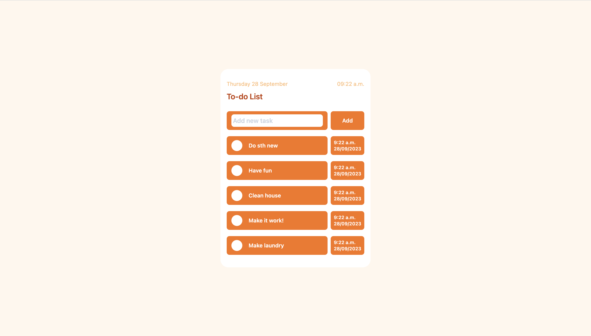

# Django project with HTMX and Tailwind CSS

This Django project demonstrates the use of HTMX and Tailwind CSS to create interactive web applications.


## Getting Started

### Prerequisites

Before you can run this application, make sure you have the following prerequisites installed:

-   Python 3.x
-   Docker and Docker Compose
-   pip-tools

### Running the Application

To launch the application, execute the following command:

```bash
make up
```

## Available Commands (using Make)

Here are some handy `make` commands to manage and interact with the project:

-   **`make update-deps`**: Update Python dependencies using pip-tools.

-   **`make up`**: Run the application using Docker Compose.

-   **`make down`**: Stop the running application.

-   **`make build`**: Manually build the Django project using Docker.

-   **`make attach`**: Attach to the `myproject` Docker container (enter into the Django project container).

-   **`make bash`**: Open a bash shell inside the `myproject` Docker container.

-   **`make shell`**: Open a Python shell with IPython inside the `myproject` Docker container.

-   **`make migrate`**: Run database migrations inside the `myproject` Docker container.

-   **`make migrations`**: Generate database migration files inside the `myproject` Docker container.

-   **`make collectstatic`**: Collect static files inside the `myproject` Docker container.

-   **`make run-build`**: Build a Docker image for development purposes.

-   **`make run`**: Run the `myproject` Docker container with environment variables from .env.

Feel free to use these commands to streamline your development workflow and interact with the project effortlessly.

## Tests

To launch written tests, run application and execute the following command:

```bash
make tests
```
